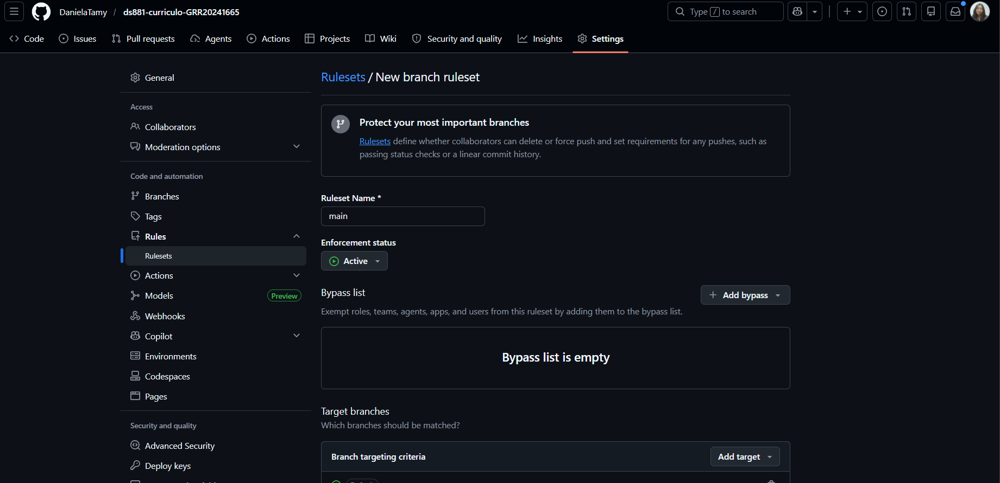
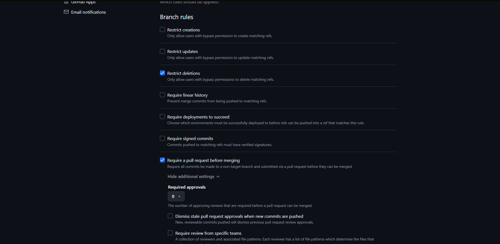
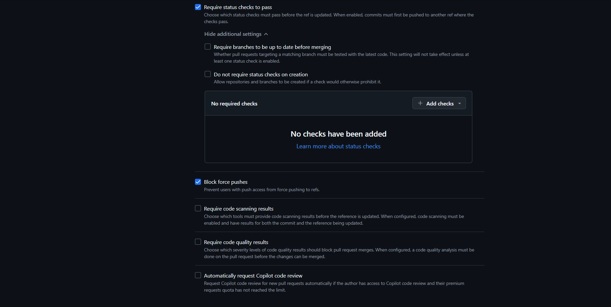
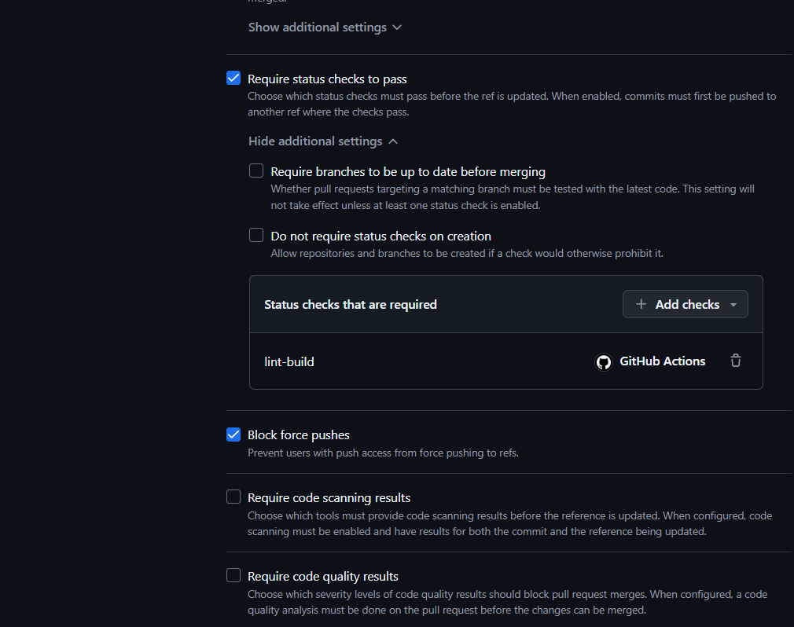

# Currículo Online - Daniela Tamy Yuki

## Link do site publicado

https://danielatamy.github.io/ds881-curriculo-GRR20241665/

## Como executar localmente com Docker

```bash
docker compose up --build
```

Acesse:

http://localhost:8080

O ambiente usa Vite como servidor de desenvolvimento, com hot reload ao salvar alteracoes nos arquivos do projeto.

Para parar:

```bash
docker compose down
```

## Tecnologias utilizadas

- HTML
- CSS
- Vite
- Docker
- Docker Compose
- GitHub Actions
- GitHub Pages

## Fluxo DevOps utilizado

O projeto utiliza Git com branches, Pull Requests, commits semânticos, proteção da branch main e pipeline automatizado com GitHub Actions.

## Evidência de Branch Protection







